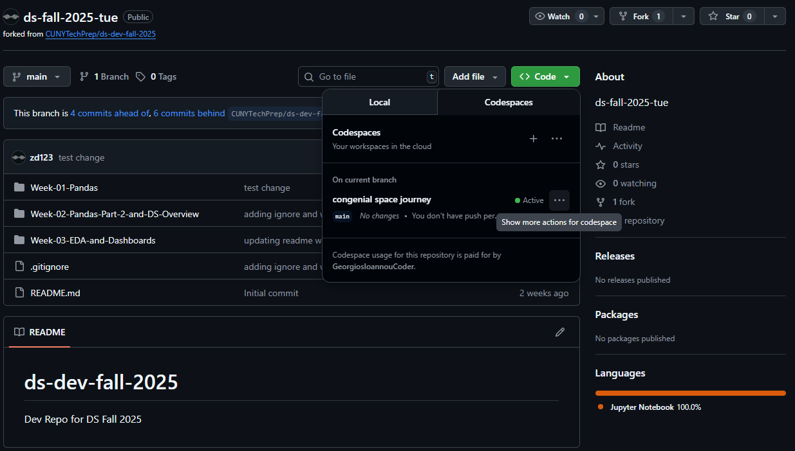

# CTP Fall Data Science 2025 

### Zoom Links
* Tuesday 6:30 - 9:00
* Wednesday 6:00 - 8:30
* Friday 12:30 - 3:00
* Friday 6:30 - 9:00

### Lecture Recordings !Please create this link @hMRZQ21 
[Links to Lecture Recordings Document](link) If you dont have permission to view doc you are using the wrong email

### Office Hours
* Ahmad Basyouni
* Hussam Marzooq
* Jessica Lau
* Kevin Li
 

# Syllabus

* Week 01 (Week of Aug 25): Pandas 1 [~1hr]  &&  Proper Github Workflow in class. [~1hr]
* Week 02 (Week of Sep 01): Pandas 2
* Week 03 (Week of Sep 08): EDA // Data Viz // Dashboards
* Week 04 (Week of Sep 15): Career Counselor Lecture [~1hr] && Real World Work && Making Teams
* Week XX (Week of Sep 22): No Class
* Week 05 (Week of Sep 29): Stats and Business Analytics 
* Week 06 (Week of Oct 06): Regressors via Linear Regression 
* Week 07 (Week of Oct 13): Classifiers via Logistic Regression 
* Week 08 (Week of Oct 20): Decision Trees / Random Forest 
* Week 09 (Week of Oct 27): Thinking Like a Data Scientist and Vibe Coding
* Week 10 (Week of Nov 03): AI Part 1
* Week 11 (Week of Nov 10): Career Counselor Lecture [~1hr] & AI Part 2
* Week 12 (Week of Nov 17): Deployment
* Week XX (Week of Nov 24): No Class
* Week 13 (Week of Dec 01): FINAL PRESENTATIONS

_*Syllabus and topics are subject to change_

# Setup Instructions (Github and Homeworks)

## Getting Started (PLEASE READ THIS CAREFULLY TO SET YOURSELF UP FOR SUCCESS THIS SEMESTER)
0. Fork the class’ main repository to your own GitHub account `ds-fall-2025-YOUR_CLASS_SECTION`.

0. Every week go to your forked repo and create a branch `firstname-lastname-week-XX` XX is the week number, eg: ahmad-basyouni-week-01

0. Press on the code button in your new fork and select Codespaces, then select `Create codespace on firstname-lastname-week-XX`

0. Go into this week’s folder in the new tab that opens

0. Once you have created your codespace and is running on the new tab, then you have the option to open it in your local VSCode

0. For homework, make a copy of the exercise notebook (don’t edit the original—make your own copy!) and paste it in the `exercises` folder

0. Name it `firstname-lastname-exercise-week-XX.ipynb`

0. Do the exercise and run all the cells, make sure no errors

0. When you are done, run these commands:
    - `git status` to see your file you need to add
    - `git add` your new file name, should look something like this:
        - `git add Week-01-Pandas/exercises/Ahmad-Basyouni-exercise-week-01.ipynb`
    - `git commit -m “your message here”`
    - `git push origin firstname-lastname-week-XX`
  

0. Go back to your class main repository on GitHub. You’ll see a prompt to create a Pull Request (PR) for your branch `Compare & Pull Request`. If you don’t see it, press on Contribute and make a PR through there.

0. Write a short description of what you did and if you completed any extra credit (e.g., “Completed week 1 homework and finished extra credit for ......“).

0. Submit the PR by pressing `Create Pull Request`. We’ll review your work and leave comments if anything needs fixing. Once it’s approved, we’ll merge it. You don’t need to merge it yourself—just wait for review and feedback.

0. From now on, in the beginning of every class make sure to pull all changes from the parent repo, so before making a new branch for the current week, go to main branch in your fork repo and do `Sync Fork` then `Update Branch`

0. Now you are ready to start from step 0, by making new branch for the current week and do the work like described above in order. Happy coding!

## Homework Submission
- All homework is due at 12:01pm (noon) the day before the next class
- Submit GitHub links to your completed exercises
